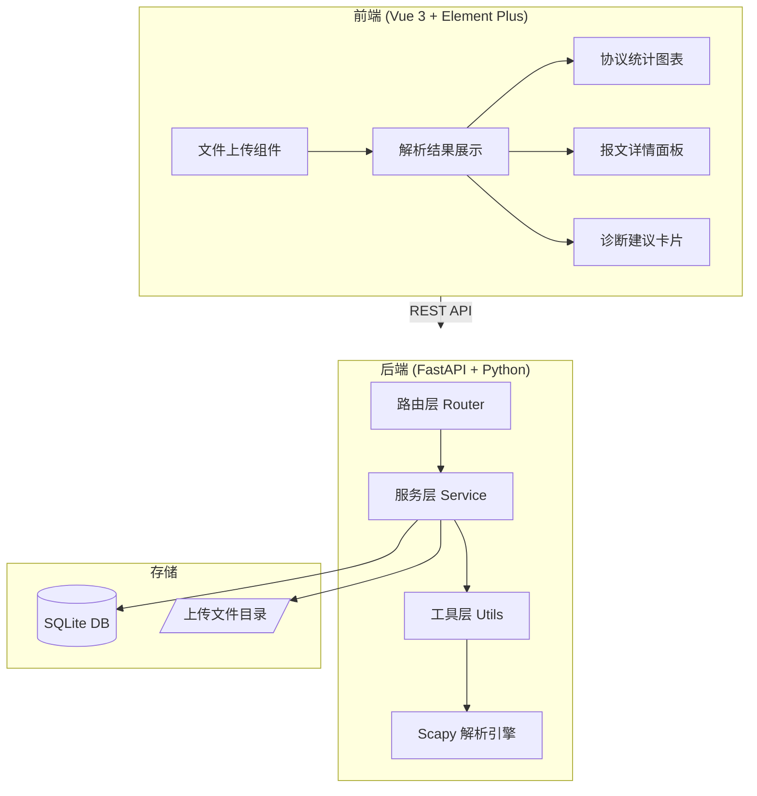
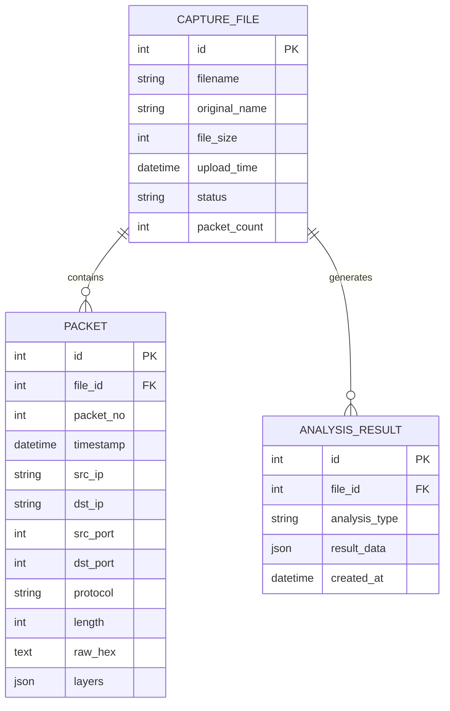

# NetDoctor 网络报文离线分析系统 - 设计文档

## 1. 系统概述

NetDoctor 是一个网络报文离线分析系统，支持上传 PCAP/PCAPNG 文件，进行协议解析、流量统计和智能诊断。

## 2. 系统架构



## 3. 数据模型 (ER 图)



## 4. API 接口清单

### 4.1 文件管理 (`/api/files`)

| Method | Endpoint | Description |
|--------|----------|-------------|
| POST | `/api/files/upload` | 上传 PCAP 文件 |
| GET | `/api/files` | 获取文件列表 |
| GET | `/api/files/{id}` | 获取文件详情 |
| DELETE | `/api/files/{id}` | 删除文件 |

### 4.2 报文分析 (`/api/packets`)

| Method | Endpoint | Description |
|--------|----------|-------------|
| GET | `/api/packets/{file_id}` | 获取报文列表（分页） |
| GET | `/api/packets/{file_id}/{packet_no}` | 获取单个报文详情 |
| GET | `/api/packets/{file_id}/filter` | 按条件过滤报文 |

### 4.3 统计分析 (`/api/analysis`)

| Method | Endpoint | Description |
|--------|----------|-------------|
| GET | `/api/analysis/{file_id}/protocol-stats` | 协议分布统计 |
| GET | `/api/analysis/{file_id}/traffic-timeline` | 流量时间线 |
| GET | `/api/analysis/{file_id}/top-talkers` | Top 通信节点 |
| GET | `/api/analysis/{file_id}/diagnosis` | 智能诊断建议 |

## 5. UI/UX 规范

### 5.1 色彩系统

```scss
// 主色调
$primary-color: #409EFF;      // Element Plus 默认蓝
$success-color: #67C23A;
$warning-color: #E6A23C;
$danger-color: #F56C6C;
$info-color: #909399;

// 背景色
$bg-page: #F5F7FA;            // 页面背景
$bg-card: #FFFFFF;            // 卡片背景
$bg-header: #2C3E50;          // 顶部导航

// 文字色
$text-primary: #303133;
$text-regular: #606266;
$text-secondary: #909399;
```

### 5.2 布局规范

- 间距基数：8px（8/16/24/32）
- 卡片圆角：8px
- 阴影：`0 2px 12px rgba(0, 0, 0, 0.1)`
- 最大内容宽度：1400px

### 5.3 组件规范

- 按钮：统一使用 Element Plus Button，带 loading 状态
- 表格：斑马纹 + 悬浮高亮
- 消息提示：操作成功/失败必须有 ElMessage 反馈

## 6. 目录结构

```
netdoctor/
├── backend/
│   ├── app/
│   │   ├── __init__.py
│   │   ├── main.py              # FastAPI 入口
│   │   ├── config.py            # 配置管理
│   │   ├── database.py          # 数据库连接
│   │   ├── routers/             # 路由层
│   │   │   ├── __init__.py
│   │   │   ├── files.py
│   │   │   ├── packets.py
│   │   │   └── analysis.py
│   │   ├── services/            # 服务层
│   │   │   ├── __init__.py
│   │   │   ├── file_service.py
│   │   │   ├── packet_service.py
│   │   │   └── analysis_service.py
│   │   ├── models/              # 数据模型
│   │   │   ├── __init__.py
│   │   │   └── schemas.py
│   │   ├── utils/               # 工具层
│   │   │   ├── __init__.py
│   │   │   ├── pcap_parser.py
│   │   │   └── protocol_analyzer.py
│   │   └── exceptions.py        # 全局异常
│   ├── uploads/                 # 上传文件目录
│   ├── requirements.txt
│   └── schema.sql
├── frontend-admin/
│   ├── src/
│   │   ├── api/                 # API 调用
│   │   ├── stores/              # Pinia 状态
│   │   ├── views/               # 页面
│   │   ├── components/          # 组件
│   │   ├── styles/              # 样式
│   │   ├── App.vue
│   │   └── main.js
│   ├── package.json
│   └── vite.config.js
├── docs/
│   └── project_design.md
└── README.md
```
